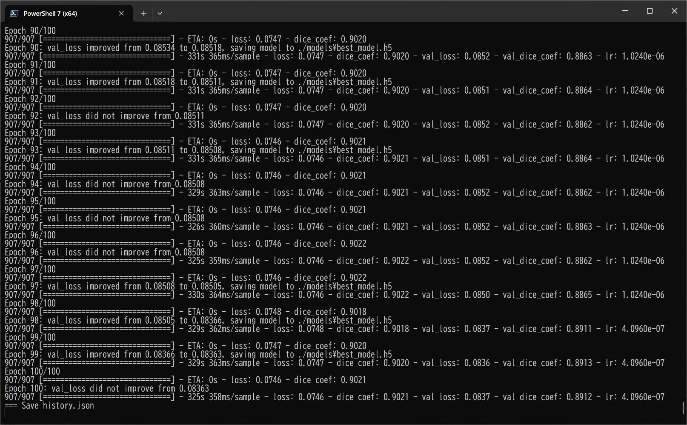

<h2>Tensorflow-Image-Segmentation-IDRiD-Retinal-Vessel (2025/03/09)</h2>
Sarah T. Arai 
Software Laboratory antillia.com  
This is the first experiment of Image Segmentation for <b>IDRiD Retinal Vessel</b>
 based on  
the latest <a href="https://github.com/sarah-antillia/Tensorflow-Image-Segmentation-API">Tensorflow-Image-Segmentation-API</a>, 
and our dataset 
<a href="https://drive.google.com/file/d/16bY4Kr4lLWAbK8t9SK12JG8gizdEba8r/view?usp=sharing">Antillia-Augmented-IDRiD-Dataset.zip (2.06G).</a>
 
 
Please see also our experiments: 
<li>
<a href="https://github.com/sarah-antillia/Tensorlfow-Tiled-Image-Segmentation-IDRiD-Retinal-Vessel">
Tensorlfow-Tiled-Image-Segmentation-IDRiD-Retinal-Vessel</a> based on 
<a href="https://ieee-dataport.org/open-access/indian-diabetic-retinopathy-image-dataset-idrid">
Indian Diabetic Retinopathy Image Dataset (IDRiD)</a>
</li>
<li>
<a href="https://github.com/sarah-antillia/Tensorflow-Tiled-Image-Segmentation-Pre-Augmented-HRF-Retinal-Vessel">
Tensorflow-Tiled-Image-Segmentation-Pre-Augmented-HRF-Retinal-Vessel</a> based on 
<a href="https://www5.cs.fau.de/research/data/fundus-images/">High-Resolution Fundus (HRF) Image Database</a>.
</li>
<li>
<a href="https://github.com/sarah-antillia/Tensorlfow-Tiled-Image-Segmentation-Pre-Augmented-DRIVE-Retinal-Vessel">
Tensorflow-Tiled-Image-Segmentation-Pre-Augmented-DRIVE-Retinal-Vessel</a> based on 
<a href="https://drive.grand-challenge.org/">DRIVE: Digital Retinal Images for Vessel Extraction</a>
</li>
<li>
<a href="https://github.com/sarah-antillia/Tensorflow-Tiled-Image-Segmentation-Pre-Augmented-STARE-Retinal-Vessel">
Tensorflow-Tiled-Image-Segmentation-Pre-Augmented-STARE-Retinal-Vessel</a> based on 
<a href="https://cecas.clemson.edu/~ahoover/stare/">STructured Analysis of the Retina</a>.
 
</li>
<li>
<a href="https://github.com/sarah-antillia/Tensorflow-Image-Segmentation-Retinal-Vessel">
Tensorflow-Image-Segmentation-Retinal-Vessel</a> based on <a href="https://researchdata.kingston.ac.uk/96/">CHASE_DB1 dataset</a>.
</li>
 

<b>Experiment Strategy</b> 
As demonstrated in
 <a href="https://github.com/sarah-antillia/Tensorflow-Image-Segmentation-FIVES-Retinal-Vessel">Tensorflow-Image-Segmentation-FIVES-Retinal-Vessel</a>
, COLOR SPACE CONVERSION (cv2.COLOR_BGR2Luv) was effective in Non-Tiled Segmentation for Retinal Vessel.
Therefore we employed the same method for this IDRiD Segmentation model. 
 
<b>Actual Image Segmentation for IDRiD images of 4288x2848 pixels</b> 

Our segementation model infers masks that are similar to the ground truth, but it does not produce satisfactory results in detail. 
The simple UNet model, which takes input images of 512x512 pixels, does not work well for segmenting of high-resolution images.
 
 
For segmentation of large images using UNet, employing a divide and conquer algorithm is a good idea. Since large images cannot be processed all at once, they are divided into small tiles. Segmentation processing is then applied to these divided small images, and finally, they are reassembled to their original size. This is our proposed Tiled Image Segmentation method 
<a href="https://github.com/sarah-antillia/Tensorlfow-Tiled-Image-Segmentation-IDRiD-Retinal-Vessel">
Tensorlfow-Tiled-Image-Segmentation-IDRiD-Retinal-Vessel</a>
 
 
<table>
<tr>
<th>Input: image</th>
<th>Mask (antillia ground_truth)</th>
<th>Prediction: inferred_mask</th>
</tr>
<tr>
<td></td>
<td></td>
<td></td>
</tr>

<tr>
<td></td>
<td></td>
<td></td>
</tr>
<tr>
<td></td>
<td></td>
<td></td>
</tr>

</table>

 
In this experiment, we used the simple UNet Model 
<a href="./src/TensorflowUNet.py">TensorflowSlightlyFlexibleUNet</a> for this HRFSegmentation Model. 
As shown in <a href="https://github.com/sarah-antillia/Tensorflow-Image-Segmentation-API">Tensorflow-Image-Segmentation-API</a>.
you may try other Tensorflow UNet Models: 

<li><a href="./src/TensorflowSwinUNet.py">TensorflowSwinUNet.py</a></li>
<li><a href="./src/TensorflowMultiResUNet.py">TensorflowMultiResUNet.py</a></li>
<li><a href="./src/TensorflowAttentionUNet.py">TensorflowAttentionUNet.py</a></li>
<li><a href="./src/TensorflowEfficientUNet.py">TensorflowEfficientUNet.py</a></li>
<li><a href="./src/TensorflowUNet3Plus.py">TensorflowUNet3Plus.py</a></li>
<li><a href="./src/TensorflowDeepLabV3Plus.py">TensorflowDeepLabV3Plus.py</a></li>
 

<h3>1 Dataset Citation</b></h3>
The dataset used here has been take from the following <b>IEEE DataPort</b> web site 

<a href="https://ieee-dataport.org/open-access/indian-diabetic-retinopathy-image-dataset-idrid">
<b>
Indian Diabetic Retinopathy Image Dataset (IDRiD)
</b>
</a>
  
Please see also <a href="https://idrid.grand-challenge.org/">
<b>DIABETIC RETINOPATHY: SEGMENNTATION AND GRAND CHALLENGE</b> </a>

 
 
<b>Citation Author(s):</b> 
Prasanna Porwal, Samiksha Pachade, Ravi Kamble, Manesh Kokare, Girish Deshmukh,  
Vivek Sahasrabuddhe, Fabrice Meriaudeau, 
April 24, 2018, "Indian Diabetic Retinopathy Image Dataset (IDRiD)", IEEE Dataport,  
 
DOI: <a href="https://dx.doi.org/10.21227/H25W98">https://dx.doi.org/10.21227/H25W98</a> 
 

<b>License:</b> 
<a href="http://creativecommons.org/licenses/by/4.0/">
Creative Commons Attribution 4.0 International License.
</a>
 

<h2>2 Augmented IDRiD Retinal Vessel Dataset </h2>
Please download the dataset from the google drive <a href="https://drive.google.com/file/d/16bY4Kr4lLWAbK8t9SK12JG8gizdEba8r/view?usp=sharing">Antillia-Augmented-IDRiD-Dataset.zip (2.06G)</a>,
expand it and place it under ./dataset to be.
<pre>
./dataset
└─Augmented-IDRiD
    ├─test
    │   ├─images
    │   └─masks
    ├─train
    │   ├─images
    │   └─masks
    └─valid
        ├─images
        └─masks
</pre>
This is a Non-Tiled 4288x2848 pixels images and their corresponding masks dataset for IDRiD Retinal Vessel. 

 
<b>Augmented-IDRiD Statistics</b> 
 
 
As shown above, the number of images of train and valid datasets is not so large, but enough 
to use for a training set of our segmentation model.
 
 
<b>Train_images_sample</b> 

 
<b>Train_masks_sample</b> 

 
<h3>
3 Train TensorflowUNet Model
</h3>
 We have trained HRF TensorflowUNet Model by using the following
<a href="./projects/TensorflowSlightlyFlexibleUNet/Augmented-IDRiD/train_eval_infer.config"> <b>train_eval_infer.config</b></a> file.  
Please move to ./projects/TensorflowSlightlyFlexibleUNet/IDRiD and run the following bat file. 
<pre>
>1.train.bat
</pre>
, which simply runs the following command. 
<pre>
>python ../../../src/TensorflowUNetTrainer.py ./train_eval_infer.config
</pre>

<b>Model parameters</b> 
Enabled Batch Normalization. 
Defined a small <b>base_filters=16</b> and large <b>base_kernels=(13,13)</b> for the first Conv Layer of Encoder Block of 
<a href="./src/TensorflowUNet.py">TensorflowUNet.py</a> 
and a large num_layers (including a bridge between Encoder and Decoder Blocks).
<pre>
[model]
base_filters   = 16
base_kernels   = (13,13)
num_layers     = 8
dilation       = (1,1)
</pre>

<b>Learning rate</b> 
Defined a small learning rate.  
<pre>
[model]
learning_rate  = 0.0001
</pre>

<b>Online augmentation</b> 
Disabled our online augmentation tool. 
<pre>
[model]
model         = "TensorflowUNet"
generator     = False
</pre>

<b>Loss and metrics functions</b> 
Specified "bce_dice_loss" and "dice_coef". 
<pre>
[model]
loss           = "bce_dice_loss"
metrics        = ["dice_coef"]
</pre>
<b >Learning rate reducer callback</b> 
Enabled learing_rate_reducer callback, and a small reducer_patience.
<pre> 
[train]
learning_rate_reducer = True
reducer_factor     = 0.4
reducer_patience   = 4
</pre>

<b>Dataset class</b> 
Specified ImageMaskDataset class.
<pre>
[dataset]
datasetclass  = "ImageMaskDataset"
resize_interpolation = "cv2.INTER_LINEAR"
</pre>

<b>Early stopping callback</b> 
Enabled early stopping callback with patience parameter.
<pre>
[train]
patience      = 10
</pre>

<b>Color space conversion</b> 
Used cv2.COLOR_BGR2Luv color converter.
<pre>
[image]
color_converter = "cv2.COLOR_BGR2Luv"
</pre>

<b>Inference</b> 
Used the original IDRiD IMAGES as a mini_test dataset for our inference images.
<pre>
[tiledinfer] 
images_dir    = "./mini_test/images"
output_dir    = "./mini_test_output_tiled"
</pre>

<b>Epoch change inference callbacks</b> 
Enabled epoch_change_infer callback. 
<pre>
[train]
epoch_change_infer      = True
epoch_change_infer_dir  = "./epoch_change_infer"
epoch_change_tiledinfer = False
epoch_change_tiledinfer_dir = "./epoch_change_tiledinfer"
num_infer_images       = 6
</pre>

By using this callback, on every epoch_change, the epoch change tiled inference procedure can be called
 for 6 images in <b>mini_test</b> folder. This will help you confirm how the predicted mask changes 
 at each epoch during your training process.    

<b>Epoch_change_tiled_inference output at starting (1,2,3,4)</b> 
 
 
 
<b>Epoch_change_tiled_inference output at ending (97,98,99,100)</b> 
 
 
 

In this experiment, the training process was terminated at epoch 100.  
 
 

<a href="./projects/TensorflowSlightlyFlexibleUNet/Augmented-IDRiD/eval/train_metrics.csv">train_metrics.csv</a> 
 

 
<a href="./projects/TensorflowSlightlyFlexibleUNet/Augmented-IDRiD/eval/train_losses.csv">train_losses.csv</a> 
 

 

<h3>
4 Evaluation
</h3>
Please move to a <b>./projects/TensorflowSlightlyFlexibleUNet/IDRiD</b> folder, 
and run the following bat file to evaluate TensorflowUNet model for IDRiD/test. 
<pre>
./2.evaluate.bat
</pre>
This bat file simply runs the following command.
<pre>
python ../../../src/TensorflowUNetEvaluator.py ./train_eval_infer.config
</pre>

Evaluation console output: 

 
 
<a href="./projects/TensorflowSlightlyFlexibleUNet/Augmented-IDRiD/evaluation.csv">evaluation.csv</a> 

The loss (bce_dice_loss) to this IDRiD/test was low, and dice_coef high as shown below.
 
<pre>
loss,0.0851
dice_coef,0.8887
</pre>
 

<h3>
5 Inference
</h3>
Please move to a <b>./projects/TensorflowSlightlyFlexibleUNet/IDRiD</b> folder 
,and run the following bat file to infer segmentation regions for images by the Trained-TensorflowUNet model for IDRiD. 
<pre>
./3.infer.bat
</pre>
This simply runs the following command.
<pre>
python ../../../src/TensorflowUNetInferencer.py ./train_eval_infer.config
</pre>

<b>mini_test_images (4288x2848 pixels)</b> 
 
<b>mini_test_mask(antillia ground_truth)</b> 
 

<b>Inferred test masks (4288x2848 pixels)</b> 
 
 

<b>Enlarged images and masks of 4288x2848 pixels</b> 

<table>
<tr>
<th>Image</th>
<th>Mask (antillia ground_truth)</th>
<th>Inferred-mask</th>
</tr>

<tr>
<td></td>
<td></td>
<td></td>
</tr>
<tr>
<td></td>
<td></td>
<td></td>
</tr>
<tr>
<td></td>
<td></td>
<td></td>
</tr>
<tr>
<td></td>
<td></td>
<td></td>
</tr>
<tr>
<td></td>
<td></td>
<td></td>
</tr>
<tr>
<td></td>
<td></td>
<td></td>
</tr>

</table>

 

<h3>
References
</h3>
<b>1. Locating Blood Vessels in Retinal Images by Piecewise Threshold Probing of a Matched Filter Response</b> 
Adam Hoover, Valentina Kouznetsova, and Michael Goldbaum 
<a href="https://www.uhu.es/retinopathy/General/000301IEEETransMedImag.pdf">
https://www.uhu.es/retinopathy/General/000301IEEETransMedImag.pdf
</a>
 
 
<b>2. High-Resolution Fundus (HRF) Image Database</b> 
Budai, Attila; Bock, Rüdiger; Maier, Andreas; Hornegger, Joachim; Michelson, Georg. 
<a href="https://www5.cs.fau.de/research/data/fundus-images/">
https://www5.cs.fau.de/research/data/fundus-images/
</a>.
 
 
<b>3. Robust Vessel Segmentation in Fundus Images</b> 
Budai, Attila; Bock, Rüdiger; Maier, Andreas; Hornegger, Joachim; Michelson, Georg. 

<a href="https://onlinelibrary.wiley.com/doi/10.1155/2013/154860">
https://onlinelibrary.wiley.com/doi/10.1155/2013/154860
</a>
 
 
<b>4. State-of-the-art retinal vessel segmentation with minimalistic models</b> 
Adrian Galdran, André Anjos, José Dolz, Hadi Chakor, Hervé Lombaert & Ismail Ben Ayed 
<a href="https://www.nature.com/articles/s41598-022-09675-y">
https://www.nature.com/articles/s41598-022-09675-y
</a>
 
 
<b>5. Retinal blood vessel segmentation using a deep learning method based on modified U-NET model</b> 
Sanjeewani, Arun Kumar Yadav, Mohd Akbar, Mohit Kumar, Divakar Yadav 
<a href="https://www.semanticscholar.org/reader/f5cb3b1c69a2a7e97d1935be9d706017af8cc1a3">
https://www.semanticscholar.org/reader/f5cb3b1c69a2a7e97d1935be9d706017af8cc1a3</a>
 
 
<b>6. Tensorflow-Tiled-Image-Segmentation-Pre-Augmented-STARE-Retinal-Vessel</b> 
Toshiyuki Arai @antillia.com 
<a href="https://github.com/sarah-antillia/Tensorflow-Tiled-Image-Segmentation-Pre-Augmented-STARE-Retinal-Vessel">
https://github.com/sarah-antillia/Tensorflow-Tiled-Image-Segmentation-Pre-Augmented-STARE-Retinal-Vessel</a>
 
 
<b>7. Tensorflow-Tiled-Image-Segmentation-Pre-Augmented-HRF-Retinal-Vessel</b> 
Toshiyuki Arai @antillia.com 
<a href="https://github.com/sarah-antillia/Tensorflow-Tiled-Image-Segmentation-Pre-Augmented-HRF-Retinal-Vessel">
https://github.com/sarah-antillia/Tensorflow-Tiled-Image-Segmentation-Pre-Augmented-HRF-Retinal-Vessel</a>
 
 
